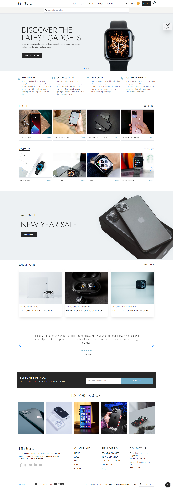

# MiniStore E-commerce website

## Introduction
   MiniStore is a full stack ecommerce web application made with the MERN stack and other libraries that coexist with the react ecosystem, keep reading to know more about its features and the list of technologies used to build it 
   - side note : the project is not complete and some sections are still under construction

## Inspiration
   - as always the best way to improve ones skills is to build stuff and that's  where https://templatesjungle.com comes in place , this website offers free figma templates that you can use in your projects. 
   - transforming the design to actual html and css was my initial goal and then using the design to build a  fully functional ecommerce website came later

   ## Available features
   - Authentication (sign up / sign in)
   - Shopping cart (CRUD operations)
   - Form validation (all the forms are validated using React Hook Form and Zod
   - Responsive design
   

   ## Technologies
   
   

## To do
-  add orders history to profile page
- add an admin panel to manage products on the store
- add blogs page and  individual blog page

## Live preview

## Home page

